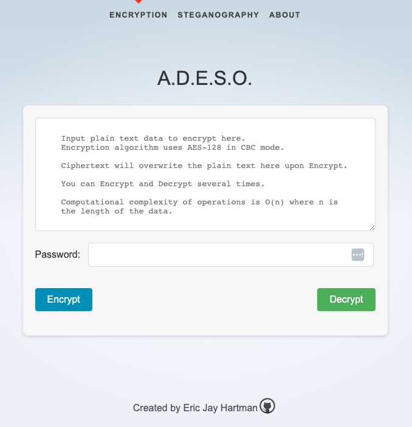
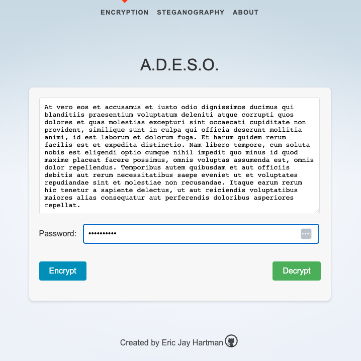
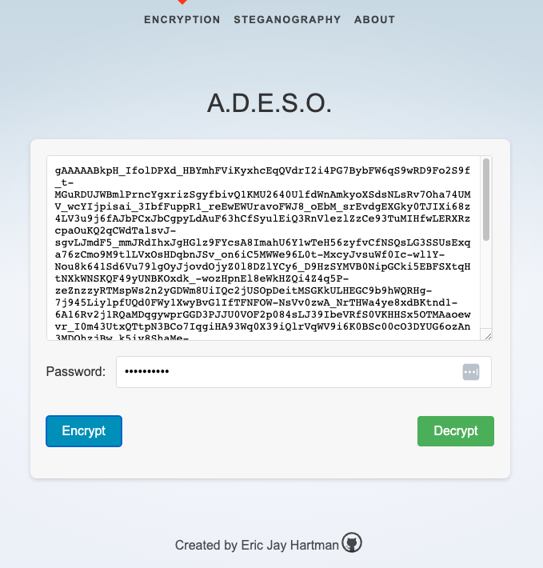
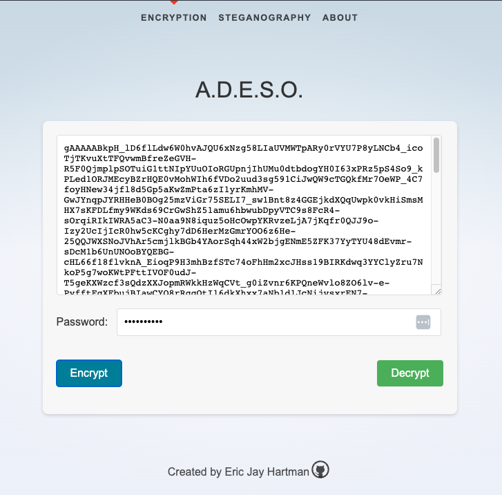

 <h2 style="margin-top: 5px; text-indent: 200px; font-size: 3em">A.D.E.S.O.</h2>
 <h2 style="margin-top: 0px; text-indent: 0px; font-size: 1.35em">
     <b>A</b>pplication for
     <b>D</b>ecryption, <b>E</b>ncryption &
     <b>S</b>teganographic <b>O</b>perations
 </h2>
 <h2 style="margin-top: 30px;"><b>Encryption</b></h2>
  
 <h2 style="margin-top: 0px; font-size: 1em;"><b>Summary</b></h2>
 
The default text in the <a href="http://127.0.0.1:5000/">Encryption</a> text area provides helpful
 information regarding the basic functionality,  
 technical details, and operations of the Encrypt and Decrypt functions.

  
 
The key features of the encryption endpoint and UI are as follows:
 <ul style="margin-top: 5px;">
  <li>Expandable text area to paste in and view large plaintext objects.</li>
    
  <li>Optional and obfuscated password field to encrypt the plaintext.</li>
    
  <li>The text area is updated in place with the plain text and ciphertext   
  based upon the Encode and Decode operation.  The password is persistent,  
  so it is easy and fast to perform sequential Encode and Decode operations  
  for enhanced and multi-layered encryption.</li>
    
  <li>All encryption, decryption, encoding and decoding is done in memory;  
  this greatly increases security by ensuring that the plaintext is never  
  written to disk, which may be recoverable via forensic analysis.</li>
   
  <li>Computational complexity is O(n), where n is the length of the data.</li>
   
  <li>The Encryption algorithm uses AES-128 in <a href="https://www.educative.io/answers/what-is-cbc">CBC</a> mode, which is a symmetric-key  
  algorithm established by <a href="https://www.nist.gov/">NIST</a>. AES is the 
  first and only publically accessible cipher   approved by the <a href="https://www.nsa.gov/">NSA</a> for
  top secret information. 
  </li>
 </ul>
 

 <h2 style="margin-top: 30px; font-size: 1em;"><b>User Interface</b></h2>

 <h2 style="margin-top: 10px; font-size: .8em;"><b>Default UI:</b></h2>
 
 

  
 <h2 style="margin-top: 10px; font-size: .8em;"><b>Plaintext Input:</b></h2>

 

  
 <h2 style="margin-top: 10px; font-size: .8em;"><b>Ciphertext Output - Single Encryption:</b></h2>

 

  
 <h2 style="margin-top: 10px; font-size: .8em;"><b>Ciphertext Output - Double Encryption:</b></h2>

 

