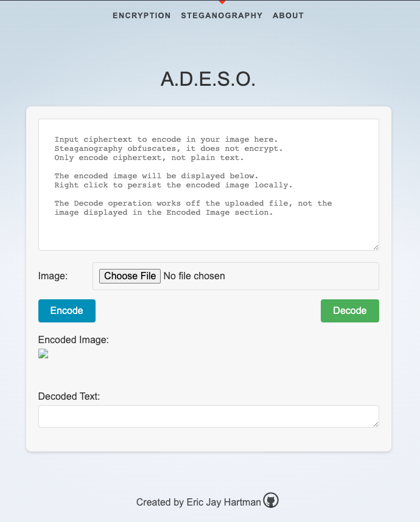
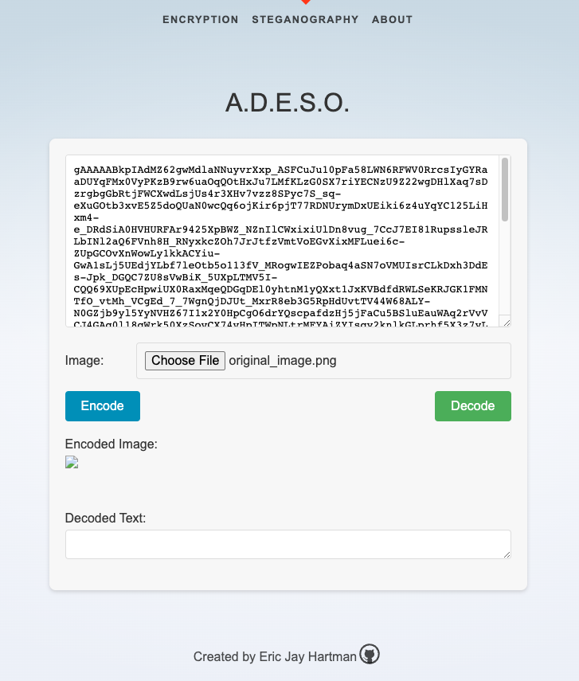
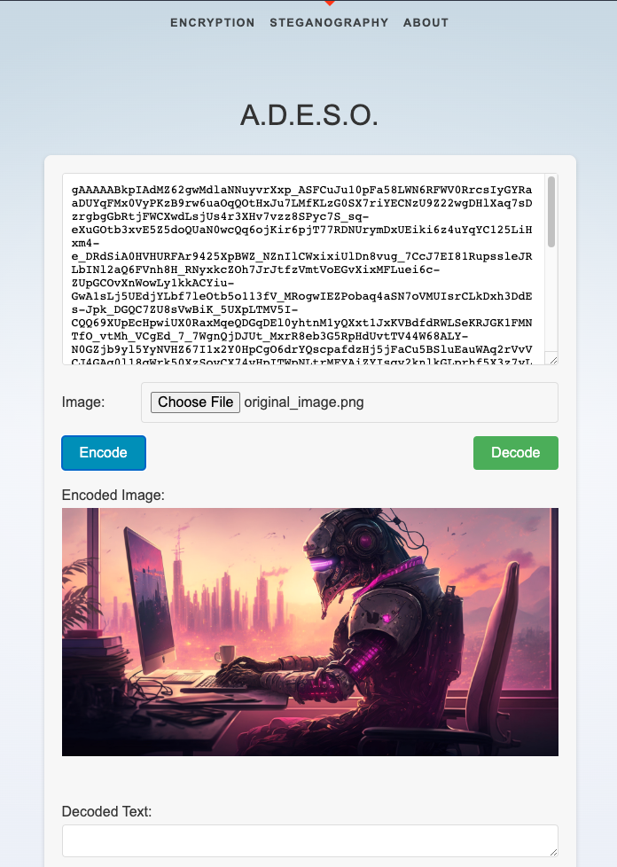
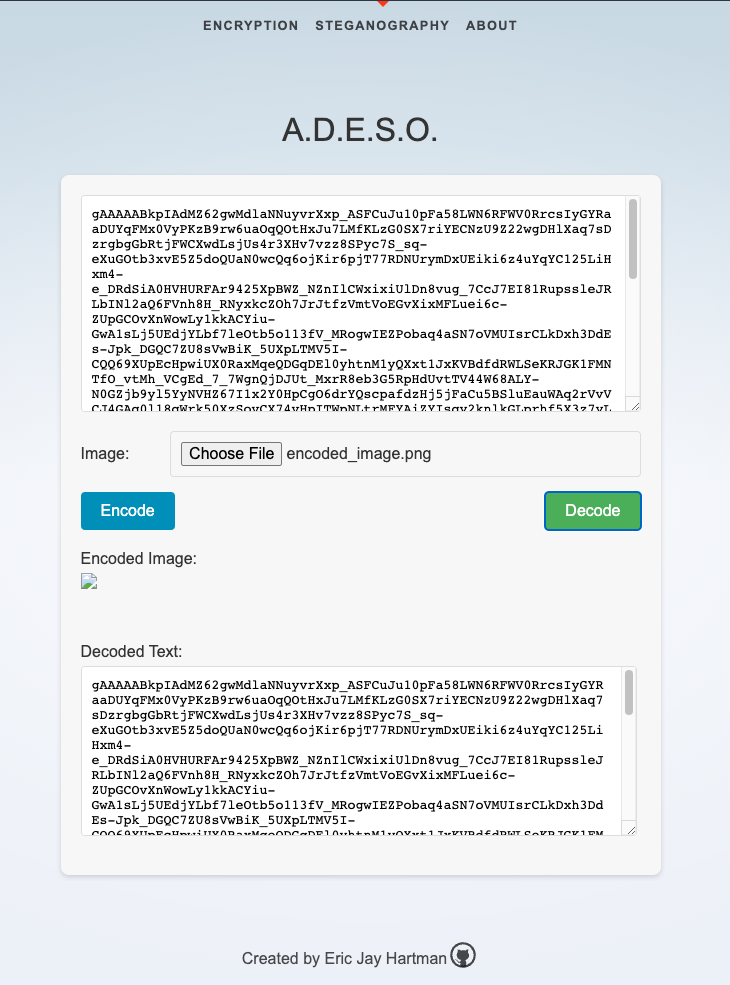

 <h2 style="margin-top: 5px; text-indent: 200px; font-size: 3em">A.D.E.S.O.</h2>
 <h2 style="margin-top: 0px; text-indent: 0px; font-size: 1.35em">
     <b>A</b>pplication for
     <b>D</b>ecryption, <b>E</b>ncryption &
     <b>S</b>teganographic <b>O</b>perations
 </h2>
 <h2 style="margin-top: 30px;"><b>Steganography</b></h2>
  
 <h2 style="margin-top: 0px; font-size: 1em;"><b>Summary</b></h2>
 
The default text in the <a href="http://127.0.0.1:5000/steganography">steganography</a> text area provides helpful
 information regarding the basic functionality,  
 technical details, and operations of the Encode and Decode functions.

  
 
The key features of the steganography endpoint and UI are as follows:
 <ul style="margin-top: 5px;">
  <li>Expandable text area to paste in and view large ciphertext objects.</li>
    
  <li>File upload for encoded and un-encoded messages for encode and decode operations.</li>
    
  <li>The encoded image is displayed on the screen in the Encoded Image section.  
  The encoded image is not persisted by default for security reasons.  It's up to  
  you to persist the image if you'd like, where you like.  Simply right click on  
  the image and save it in your desired location.</li>
   
  <li>The decode operation works on the file chosen, not the encoded image displayed  
  on screen.  So, importantly, if you'd like to decode your encoded image to verify that  
  the operation worked, you must first save it, then re-select it via the Choose File button.</li>
   
  <li>The data decoded from the image is displayed in the Decoded Text text area.  Importantly,  
  the operation may take some time based upon the size of the image, and the size of the ciphertext.  
  There is no "processing" message, so you'll need to be patient.  You can inspect the page to see  
  if there is an error if you suspect the operation is taking too long.  If there is an API error,  
  you can stop the program and re-start it.
  </li>
 </ul>
 

 <h2 style="margin-top: 30px; font-size: 1em;"><b>User Interface</b></h2>

 <h2 style="margin-top: 10px; font-size: .8em;"><b>Default UI:</b></h2>
 
 

  
 <h2 style="margin-top: 10px; font-size: .8em;"><b>Ciphertext Input:</b></h2>

 

  
 <h2 style="margin-top: 10px; font-size: .8em;"><b>Encoded Image Output</b></h2>

 

  
 <h2 style="margin-top: 10px; font-size: .8em;"><b>Decoded Ciphertext Output</b></h2>

 

